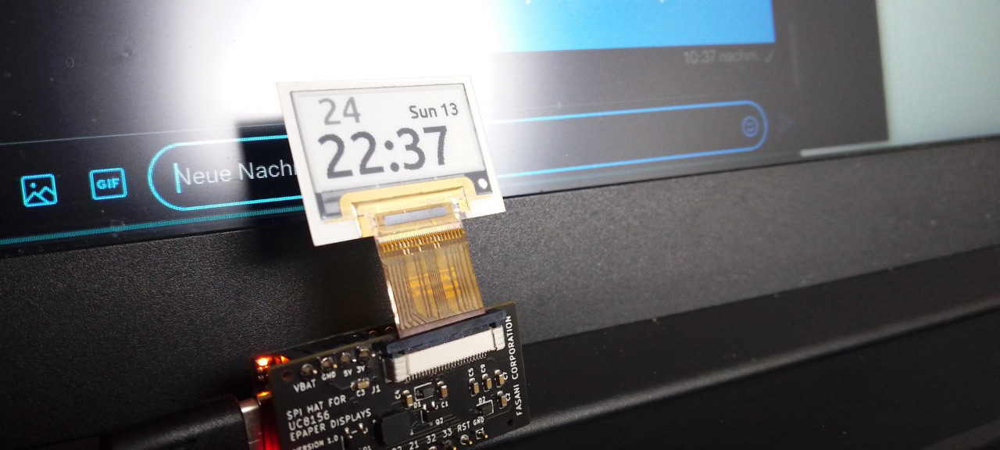

## PlasticLogic flexible deepsleep clock

A very easy deepsleep clock ported from an [ESP-IDF example](https://github.com/martinberlin/cale-idf/blob/master/main/demo-sleep-clock-v2.cpp) to Arduino.
Simply makes an internet Sync a day and stores the time in NVS 

This sketch uses Robert Poser [PL_microEPD](https://github.com/RobPo/Paperino) library added locally with custom modifications.

## Requirements

Latest Arduino-esp32 added in Arduino IDE -> Preferences -> Additional board URLS

     https://raw.githubusercontent.com/espressif/arduino-esp32/gh-pages/package_esp32_index.json

- **Adafruit GFX** added as a global library
- [SPI Tinypico Adapter for UC8156 displays](https://www.tindie.com/products/fasani/tinypico-small-uc8156-epaper-hat)
- One of the PlasticLogic.com/sampleshop UC8156 epaper displays (1.1,2.1 or 3.1 inches)

## Configuration

Simply open the **plastic_epaper_clock.ino** in Arduino IDE and set up points 1 to 3:

- 1 Edit in Pl_microEPD.h the right EPD_WIDTH / EPD_HEIGHT for Adafruit GFX instantiation
- 2 Update the ESP_WIFI Credentials so it can connect to the internet
- 3 Flash with forceSync=true on first run so the right time is stored in NVS

